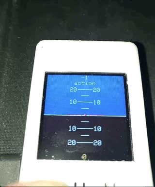

# TTGO_TS ESP32 AHD w/ PlatformIO+VSCode
 
An artificial horizon display(128x128) with TTGO_TS_ESP32 MPU9250   
 

 &nbsp;&nbsp;&nbsp; 

### References
  - [TFT_eSPI](https://github.com/Bodmer/TFT_eSPI) 
  - [Arduino AHD](https://www.youtube.com/watch?v=uzmPFqYQigQ)

